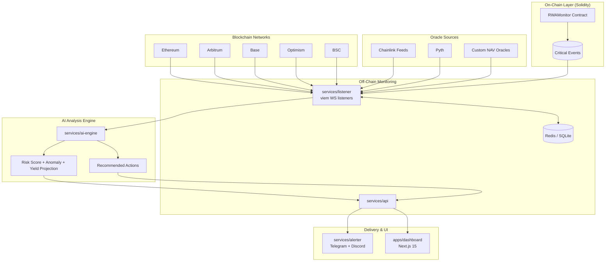

# MultiChain-RWA-AI-Agent-Monitor

<p align="center">
  <b>AI-native, multi-chain monitoring for tokenized Real World Assets (RWA)</b><br/>
  <sub>Real-time risk detection, yield intelligence, and actionable alerts across 5 chains.</sub>
</p>

<p align="center">
  <a href="https://github.com/zirifqi/MultiChain-RWA-AI-Agent-Monitor/actions/workflows/ci.yml"></a>
  
  
  
  
  
</p>

---

## Why this project?

Tokenized RWAs need more than price tracking. They need **context-aware monitoring** across chains, with intelligent analysis and actionable outcomes.

**MultiChain-RWA-AI-Agent-Monitor** combines:
- On-chain event intelligence
- Multi-oracle RWA state aggregation
- AI risk/yield reasoning
- Multi-channel alert delivery
- Operator-friendly dashboard

All in one open-source stack.

---

## Supported Chains

| Chain | Chain Type | Priority | Data Mode |
|---|---|---:|---|
| Ethereum Mainnet | L1 | P0 | WebSocket + RPC fallback |
| Arbitrum One | L2 | P0 | WebSocket + RPC fallback |
| Base | L2 | P0 | WebSocket + RPC fallback |
| Optimism | L2 | P0 | WebSocket + RPC fallback |
| BNB Smart Chain (BSC) | L1 | P1 | WebSocket + RPC fallback |

---

## Core Features

### 1) Multi-Chain RWA Data Aggregator
- Unified ingestion for Chainlink Data Feeds, Pyth, and custom NAV oracles
- Consistent normalization across chain-specific quirks
- Failover-aware RPC and websocket strategy

### 2) Solidity Event Layer (Foundry)
- Emits critical RWA monitoring events, including:
  - `NAVUpdated`
  - `YieldDropped`
  - `MaturityApproaching`
  - `LargeTransferDetected`
  - `ComplianceFlagRaised`
- Upgrade-friendly architecture (UUPS) with secure ownership flow (`Ownable2Step`)

### 3) Parallel Off-Chain Monitoring Bot
- Multi-chain listeners running concurrently with `viem`
- State + event fusion for better signal quality
- Durable caching via Redis/SQLite

### 4) AI Analysis Layer
- Structured JSON output for deterministic downstream actions
- Risk scoring + anomaly detection + yield trend intelligence
- Clear, explainable recommendations with confidence metadata

### 5) Actionable Alerts
- Telegram + Discord alert pipelines
- Severity-based templates (info / warning / critical)
- Optional deduplication and escalation logic

### 6) Dashboard (Next.js 15)
- Live feed of events, scores, and alerts
- Chain-level filtering and asset drill-down
- Lightweight operator workflows for incident review

### 7) Security + Quality Baseline
- Foundry testing (unit/integration/fuzz/invariant)
- Static analysis with Slither + Mythril
- CI checks and gas-aware workflows

---

## High-Level Architecture



---

## Repository Layout

```text
.
├── apps/
│   └── dashboard/                 # Next.js 15 + Tailwind + shadcn/ui
├── services/
│   ├── listener/                  # Multi-chain event/state listener
│   ├── ai-engine/                 # LLM-based analysis pipeline
│   ├── alerter/                   # Telegram/Discord delivery
│   └── api/                       # Backend API / BFF
├── contracts/                     # Solidity + Foundry tests/scripts
├── packages/
│   ├── shared-types/              # Shared TS schemas/types
│   ├── shared-config/             # Shared lint/tsconfig/env settings
│   └── sdk/                       # Optional external integration SDK
├── infra/                         # Docker, Redis, SQLite, monitoring assets
├── docs/                          # Architecture, ADR, security, runbooks
└── .github/workflows/             # CI pipelines
```

---

## Quick Start

### Prerequisites

- Node.js **22+**
- pnpm **10+**
- Foundry (forge/cast/anvil)
- Docker (optional for local Redis/monitoring stack)

### 1) Clone

```bash
git clone git@github.com:zirifqi/MultiChain-RWA-AI-Agent-Monitor.git
cd MultiChain-RWA-AI-Agent-Monitor
```

### 2) Install dependencies

```bash
pnpm install
```

### 3) Environment setup

```bash
cp .env.example .env
# Fill RPC, WS, oracle, AI, Telegram, and Discord variables
```

### 4) Run development stack

```bash
pnpm dev
```

### 5) Run smart contract tests

```bash
cd contracts
forge test -vvv
```

### 6) Run quality checks

```bash
pnpm lint
pnpm test
pnpm typecheck
```

---

## Development Principles

- **Deterministic pipelines:** AI output must be structured and machine-verifiable
- **Defense in depth:** combine static analysis + test coverage + least-privilege ops
- **Fail gracefully:** every chain listener uses retry/fallback and observable health checks
- **Open-source friendly:** clean modules, clear docs, and contributor-first workflow

---

## Roadmap (Near Term)

- [ ] RWAMonitor v1 contract implementation + event schema finalization
- [ ] Chain adapters for all 5 networks with replay-safe cursoring
- [ ] AI scoring pipeline v1 with confidence and rationale fields
- [ ] Alert routing policy engine (severity + dedupe + cooldown)
- [ ] Dashboard MVP with live alert timeline and chain filters
- [ ] CI security stage (Slither + Mythril + gas report)

---

## Contributing

Pull requests are welcome. Please open an issue first for major changes.

When contributing:
1. Keep scripts/docs/messages in English
2. Add tests for logic changes
3. Preserve typed interfaces across services

---

## License

MIT License


## Development Commands (Current Scaffold)

```bash
# Install all workspaces
pnpm install

# Run DB migrations (SQLite)
pnpm db:migrate

# Check migration status
pnpm db:migrate:status

# Start listener
pnpm --filter @rwa-monitor/listener dev

# Start alerter
pnpm --filter @rwa-monitor/alerter dev

# Start API
pnpm --filter @rwa-monitor/api dev
```

## Environment

Create a local environment file from the template:

```bash
cp .env.example .env
```
